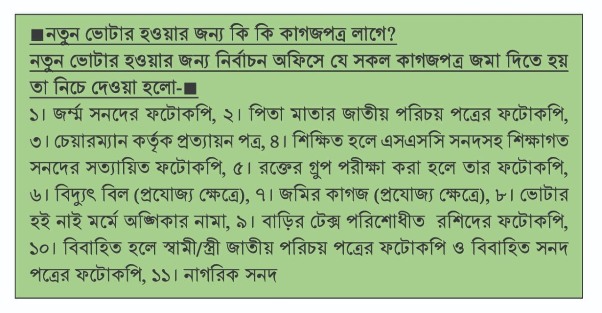

# Nid-apply-file-setup
h

onlain apply kagoj 

(১) জন্ম নিবন্ধন

(২) পিতা মাতা nid ফটোককপি

(৩) পর্চা

(৪) অঙ্গীকার নামা

(৫) রক্তের গুরুফ কাগজ

(৬) ইউনিয়ন অফিস থেকে নতুন ভোটার প্রত্রয়ন

(৭) নাগরিক্ত সনদ

(9) বিদুৎ বিল

(১০) tax কাগজ [ পিতার নামে]

(১১) ১১ নং ফরম

(১২) শিক্ষাগত যোগ্যতা সনদ

(১৩) বিবাহিত হলে,  কাবিন নামা,বউ এর nid ফটোকপি

<!--[profile](./ni.jpg)-->

